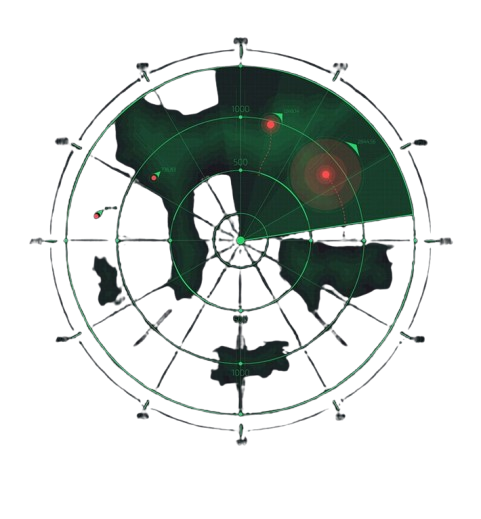
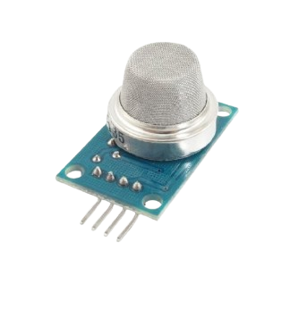
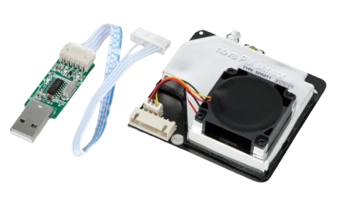
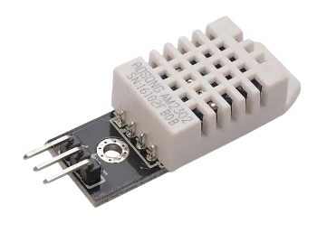
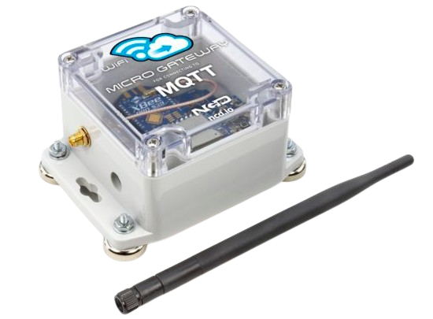

# IOTSL---Air-quality

 Dispositivo coleta dados da qualidade do ar, como níveis de CO₂, PM2.5, temperatura e umidade.

É recomendável uma rede de dispositivos distribuídos para capturar os dados com perímetro maior.

# Configurações

- Raspberry Pi Zero W

  
Ativar o SSH para acessar remotamente e instalar Raspberry Pi OS Lite para reconhecimento do dispositivo.

--------------------------------------------------------------------------------

**TERMINAL**

sudo apt update

sudo apt install python3 python3-pip

pip3 install paho-mqtt Adafruit_DHT pyserial

---------------------------------------------------------------------------------

# SENSORES

Sensor MQ135 (CO₂ e qualidade do ar)

Sensor SDS011 (PM2.5) - Leitura de partículas inferiores a 2,5 micrômetros.

Sensor DHT22 (Temperatura e umidade)

Sensor MQTT - Envio de dados

---------------------------------------------------------------------------------
# Interface > sem dados reais

---------------------------------------------------------------------------------
**Google**

**MIT LICENCE ©**
